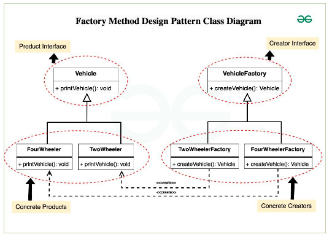

# Vehicle Factory Design Pattern

This project demonstrates the **Factory Method Design Pattern** in C#. The Factory Method Pattern provides an interface for creating objects in a superclass while allowing subclasses to specify the types of objects they create. In this example, we implement a simple vehicle factory that can create either a two-wheeler or a four-wheeler.

## Introduction

The Factory Method Pattern is a creational pattern that provides a way to delegate the instantiation of objects to subclasses. This allows for greater flexibility and encapsulation in your code.

In this example, we define an abstract class `Vehicle`, which has concrete implementations for `TwoWheeler` and `FourWheeler`. A `Client` class is used to instantiate the vehicles based on user input.
([example.cs] conatains code without Factory Method Design Pattern)

## UML

